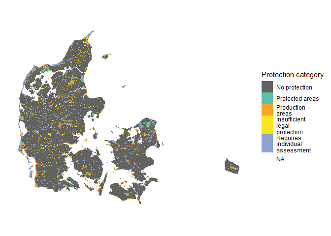

<!-- README.md is generated from README.Rmd. Please edit that file -->

# IdentifyingConservationGaps

<!-- badges: start -->

<!-- badges: end -->

This repository documents the data and R code used to reproduce the
terrestrial analyses and **Fig. 1** in the manuscript *Identifying
Conservation Gaps: A Framework for Evaluating National Contributions to
the 30x30 Target*.

Fig. 1 shows how Denmark’s terrestrial areas contribute to the **30%
land target**, distinguishing between:

- areas that fully qualify as contributing protected areas,
- areas requiring individual assessment,
- areas with insufficient legal protection,
- areas compromised by infrastructure, forestry, or agriculture, and
- areas without protection schemes.

This README focuses on the spatial data processing steps used to derive
the terrestrial map and summary statistics for Fig. 1 and table S2 in
the supplementary material.

## Software, packages and helper functions

All spatial analyses were carried out in R using the following core
packages:

- [`terra`](https://cran.r-project.org/package=terra) for raster and
  vector processing,  
- [`ggplot2`](https://cran.r-project.org/package=ggplot2) and
  [`tidyterra`](https://cran.r-project.org/package=tidyterra) for
  visualisation, and  
- [`geodata`](https://cran.r-project.org/package=geodata) to obtain the
  national boundary of Denmark.

We also use [`dplyr`](https://cran.r-project.org/package=dplyr) and
[`purrr`](https://cran.r-project.org/package=purrr) for data
manipulation and iteration,  
[`stringr`](https://cran.r-project.org/package=stringr) for text
wrapping in legend labels, and the GitHub package  
[`BDRUtils`](https://github.com/derek-corcoran-barrios/BDRUtils)
(BiodiversitetRåders utilities) for helper functions used in Table S2
(notably `exclusivity_table()`).

In addition, we define a helper function:

- `write_cog()` to save a `SpatRaster` as a Cloud Optimized GeoTIFF
  (COG) using GDAL options for compression.

``` r
library(geodata)
library(ggplot2)
library(terra)
library(tidyterra)
library(stringr)   # for stringr::str_wrap used below
library(BDRUtils)
library(dplyr)
library(purrr)
```

``` r

# Helper to write a SpatRaster as a Cloud Optimized GeoTIFF (COG)

write_cog <- function(SpatRaster, Name) {
  terra::writeRaster(
    x        = SpatRaster,
    filename = Name,
    overwrite = TRUE,
    gdal      = c("COMPRESS=DEFLATE", "TFW=YES", "of=COG")
  )
}
```

## Spatial template and national boundary

All rasters used in the analysis are aligned to a common template
defining the extent, resolution and coordinate reference system.

``` r
Template <- terra::rast("Data/Template.tif")

DK <- geodata::gadm(country = "Denmark", level = 0, path = getwd(), version = "4.0") |> 
  terra::project(terra::crs(Template))
```

We then calculate the terrestrial area of Denmark in square kilometres:

``` r
Area_DK <- terra::expanse(DK, unit = "km")
```

This yields a total terrestrial area of 43,144.85 square kilometers.

## Built-up areas

To identify areas that genuinely contribute to the 30% target, we
exclude built-up areas (infrastructure and urban land), which cannot
contribute to biodiversity protection. Built-up areas were extracted
from the land-cover layer in
[basemap](https://envs.au.dk/en/research-areas/society-environment-and-resources/land-use-and-gis/basemap).

Here, `BuildUp` is a raster where  
0 = built-up (infrastructure, urban areas),  
1 = other land.

Pixels classified as built-up (`BuildUp == 0`) are removed from layers
intended to represent contributing protected areas, and are flagged as
compromised where relevant (e.g. in the production/pressure layers).

This raster is prepared in the data pre-processing steps (not shown
here).

``` r
BuildUp <- terra::rast("Data/Rast_BuildUp_Croped.tif")
```

## Areas contributing to the 30% target

In fig 1, areas that **fully contribute** to the 30% land target are
shown in turqouise (protected areas). These areas encompass areas under
protection schemes with no landuses compromising biodiversity and that
meet all criteria C1–C5 for protected areas (Table 1 in the manuscript).

On land, these are:

- **Approved Nature National Parks**
- **Areas owned by private nature foundations**
- **State-owned unmanaged / untouched forests**

Below we show how these layers are read, harmonised and combined into a
single raster representing all terrestrial areas that contribute to the
30% target.

To track overlaps between protection schemes, each scheme is encoded as
a binary layer with a **distinct base value** (Nature National Park = 1,
Private Nature Foundations = 10, State-owned Unmanaged Forests = 100).
When these layers are summed, each combination of schemes yields a
unique value (e.g. 1 = Nature National Park only; 11 = Nature National
Park + private nature foundation; 111 = all three schemes).

### Approved Nature National Parks

We read the raster of approved Nature National Parks and convert it to a
binary layer where:

0 = not an approved Nature National Park,  
1 = approved Nature National Park.

In the original raster, Nature National Parks are coded as 0 and all
other pixels are `NA`; these are recoded to a simple presence/absence
layer.

``` r
NNP_approved <- terra::rast("Data/Rast_Nature_National_Parks_Croped.tif")

NNP_approved <- terra::ifel(!is.na(NNP_approved), 1, 0)
```

### Private nature foundations

Similarly, we read the raster of areas owned by private nature
foundations (`Fondsejede`) and encode it as

0 = not foundation-owned, 10 = foundation-owned.

``` r
Fondsejede <- as.numeric(terra::rast("Data/Rast_Fondsejede_Croped.tif")) + 10
Fondsejede <- terra::ifel(is.na(Fondsejede), 0, Fondsejede)
```

### State-owned Unmanaged / untouched forests

We then read the raster of state-owned unmanaged / untouched forests
(`UroertSkov_NST`) and encode it as

0 = not unmanaged / untouched forest, 100 = unmanaged / untouched
forest.

``` r
UroertSkov_NST <- as.numeric(terra::rast("Data/Rast_Urort_Skov_Croped.tif")) + 99
UroertSkov_NST <- terra::ifel(is.na(UroertSkov_NST), 0, UroertSkov_NST)
```

### Generate composite layer

We now add the three layers to obtain a **composite raster** `PA30`,
where the value of each pixel uniquely identifies which combination of
schemes covers that pixel.

``` r
PA30 <- NNP_approved + Fondsejede + UroertSkov_NST

cls <- data.frame(
  ID    = c(1, 10, 11, 100, 101, 110, 111),
  class = c("NNP_approved",
            "Fondsejede",
            "NNP_Fondsejede",
            "UroertSkov_NST",
            "NNP_Uroert",
            "Fondsejede_Uroert",
            "NNP_Fondsejede_Uroert")
)

PA30 <- terra::ifel(PA30 == 0, NA, PA30)
```

We then remove built-up areas and mask the result to the terrestrial
area of Denmark.

``` r
PA30 <- terra::ifel(BuildUp == 0, NA, PA30)

levels(PA30) <- cls

PA30 <- terra::mask(PA30, DK)
```

Finally, we save the composite layer as a Cloud Optimised GeoTIFF:

``` r
write_cog(PA30, "FinalLayers/PA30.tif")
```

This layer corresponds to the **turquoise category** (“Protected areas
that fully meet the criteria”) in Fig. 1 of the manuscript.

## Production areas (areas compromising biodiversity)

In Fig. 1, areas where biodiversity is directly compromised by human
land uses (e.g. intensive agriculture, production forestry,
infrastructure) are shown in **orange** (“Areas compromised by
infrastructure, forestry, or agriculture”).

These areas are identified by combining:

- agricultural land (fields in rotation and permanent grasslands not
  covered by Article 3 protection),
- production forest (tree-covered areas not designated as unmanaged
  forest or Article 3 areas), and
- infrastructure (roads, buildings and other built-up areas).

In the analysis pipeline, these inputs are assembled into a raster layer
where pixels used primarily for these land uses are flagged as
**compromised** and subsequently excluded from contributing to the 30%
target. The resulting raster is then used to derive the orange category
in Fig. 1.

### Reading and combining the layers

We use a raster (`Subclasses`) which classifies the areas that are
within at least one protection scheme, that includes, among others,
fields in rotation (`"INT_AGG"`), grasslands not covered by Article 3
protection (`"PGR_out_of_P3"`), and production forest (`"Drevet Skov"`).
We merge these classes into a single layer of production areas.

``` r
Subclasses<- rast("Data/Subclasses.tif")

ProductionAreas <- Template

ProductionAreas <- terra::ifel(Subclasses %in% c("Drevet Skov", "INT_AGG", "PGR_out_of_P3"), 1, 0)
```

We then add built-up areas (from `BuildUp`, read above). Pixels that are
both within the `Subclasses` (this means that is part of some protection
scheme) raster and classified as built-up (`BuildUp == 0`) are also
flagged as production / compromised areas.

``` r
ProductionAreas <- terra::ifel(!is.na(Subclasses) & BuildUp == 0, 1, ProductionAreas)

ProductionAreas <- terra::mask(ProductionAreas, DK)

cls <- data.frame(id=0:1, Protection=c("other",stringr::str_wrap("Production areas", 10)))
levels(ProductionAreas) <- cls
```

Finally, we save the production / compromised areas as a Cloud Optimised
GeoTIFF:

``` r
write_cog(ProductionAreas, "FinalLayers/ProductionAreas.tif")
```

This layer underpins the **orange category** in Fig. 1.

## Insufficient legal protection

Areas under protection schemes that do not meet the criteria for
long-term legal protection (Criterion C1) or other key criteria (C2–C5)
are classified as having **insufficient legal protection**.

On land, this primarily concerns **private Article 3 areas**, where:

- long-term protection is not secured, and
- there are no management requirements preventing habitat changes that
  would undermine biodiversity values (e.g. succession from open
  habitats to forest).

To operationalise this, we identify areas that:

1.  are covered by **exactly one** protection scheme,
2.  fall under the **Article 3** protection scheme, and
3.  are on **privately owned** land.

Pixels meeting all three conditions form the “insufficient legal
protection” category (yellow in Fig. 1).

### Identifying private Article 3 areas with a single protection scheme

First, we read a raster that records how many protection schemes apply
to each pixel:

``` r
NumberOfProtections <- terra::rast("Data/Rast_NumberOfProtections_Croped.tif")

# Keep only pixels with exactly one protection scheme; reclassify others to 0
NumberOfProtections <- terra::ifel(NumberOfProtections != 1, 0, NumberOfProtections)
```

Next, we read the Article 3 protection raster. In our case this layer is
stored on a shared drive; the path should be adapted to your local
setup. We convert it to a binary layer where 1 indicates Article 3
protection and 0 indicates “unknown” or lakes.

``` r
P3 <- terra::rast("Data/Rast_p3_Croped.tif")
P3 <- as.numeric(P3)

# Remove both unknown (ukendt) and lakes (Soer):
# 0–3, 5  = Article 3 categories kept as 1
# 4, 6    = set to 0 (e.g. lakes, unknown)
P3 <- terra::ifel(P3 %in% c(0:3, 5), 1, P3)
P3 <- terra::ifel(P3 %in% c(4, 6), 0, P3)
P3 <- terra::ifel(is.na(P3), 0, P3)
```

We then read in the ownership data, convert it to a binary “private
vs. other” layer, and resample it to match the resolution and extent of
the Article 3 raster:

``` r
Ownership <- terra::rast("Data/Ownership2025.tif")
Ownership <- as.numeric(Ownership)

# Keep only private areas (Ownership == 1)
Private <- Ownership
Private <- terra::ifel(Private == 1, 1, 0)

# Align to the P3 raster
Private <- terra::resample(Private, P3, method = "near")
```

Finally, we multiply the three binary layers to obtain areas that:

- are only protected by a single scheme (NumberOfProtections == 1),
- are Article 3 areas (P3 == 1), and
- are privately owned (Private == 1).

These pixels are then masked to the Denmark polygon and labelled:

``` r
Private_P3 <- Private * P3 * NumberOfProtections

# Consider only pixels within Denmark
Private_P3 <- terra::mask(Private_P3, DK)

cls <- data.frame(
  id         = 0:1,
  Protection = c("other", stringr::str_wrap("Insufficient legal protection", 10))
)
levels(Private_P3) <- cls
```

We save this layer as a Cloud Optimised GeoTIFF:

``` r
write_cog(Private_P3, "FinalLayers/InsufficientLegalProtection.tif")
```

This layer corresponds to the **yellow category** (“Insufficient legal
protection”) in Fig. 1 of the manuscript.

## Requires individual assessment

Some protection schemes cannot be fully evaluated with the available
information (for example, because management prescriptions or long-term
legal guarantees are not consistently documented at the ecosystem
level). For these cases, the criteria C1–C5 cannot be conclusively
assessed.

In the manuscript, areas that **require individual assessment**
primarily include:

Pixels that fall inside a protection scheme and that are not already
classified as fully contributing protected areas, production areas or
insufficient legal protection, are placed in the “requires individual
assessment” category (lavender in Fig. 1).

### Identifying areas that require individual assessment

We use the Subclasses layer to identify pixels that are inside and out
of the protection schemes and transform it into a binary layer, that we
will later used to build a harmonized layer

Any pixel within the protection schemes will be considered a candidate
to be in the **requires individual assessment** category.

``` r
RIA <- terra::ifel(!is.na(Subclasses), 1, 0)

RIA <- terra::mask(RIA, DK)

cls_RIA <- data.frame(
  id         = 0:1,
  Protection = c("other", stringr::str_wrap("Requires individual assessment", 10))
)
levels(RIA) <- cls_RIA
```

Finally, we save this layer as a Cloud Optimised GeoTIFF:

``` r
write_cog(RIA, "FinalLayers/RequiresIndividualAssessment.tif")
```

This binary raster (`RIA == 1`) corresponds to the **lavender category**
(“Requires individual assessment”) in Fig. 1 of the manuscript.

## Harmonised final protection layer and category prioritisation

The protection categories described above are not mutually exclusive: a
given pixel can belong to more than one scheme (for example, a Natura
2000 site that is also an Article 3 area). To produce the final map in
Fig. 1, we therefore create a **harmonized categorical raster** in which
each pixel is assigned to a single category, following a fixed priority
order:

1.  **Protected areas** (fully contributing to the 30% target)
2.  **Production areas** (areas where biodiversity is compromised by
    land use)
3.  **Insufficient legal protection**
4.  **Requires individual assessment**

Pixels outside the terrestrial area of Denmark are masked out.

We implement this by combining the rasters defined above:

- `PA30` – composite layer of fully contributing protected areas
- `ProductionAreas` – production / compromised areas
- `Private_P3` – areas with insufficient legal protection
- `RIA` – areas requiring individual assessment

``` r
# Start from a template aligned to PA30
FinalLayer <- PA30
FinalLayer[] <- 0
FinalLayer <- terra::mask(FinalLayer, DK)

# 1: Protected areas (fully contributing to the 30% target)
FinalLayer[!is.na(PA30)] <- 1

# 2: Production areas (where biodiversity is compromised)
FinalLayer[ProductionAreas == 1 & FinalLayer == 0] <- 2

# 3: Insufficient legal protection (private Article 3, single-scheme protection)
FinalLayer[Private_P3 == 1 & FinalLayer == 0] <- 3

# 4: Requires individual assessment (remaining schemes with incomplete information)
FinalLayer[RIA == 1 & FinalLayer == 0] <- 4


cls_Final <- data.frame(
  id         = 0:4,
  Protection = c(
    stringr::str_wrap("No protection", 15),
    stringr::str_wrap("Protected areas", 15),
    stringr::str_wrap("Production areas", 15),
    stringr::str_wrap("Insufficient legal protection", 15),
    stringr::str_wrap("Requires individual assessment", 15))
)
levels(FinalLayer) <- cls_Final
```

We then save the harmonised final layer as a Cloud Optimised GeoTIFF:

``` r
write_cog(FinalLayer, "FinalLayers/FinalLayer.tif")
```

This **categorical raster** is the basis for the map and the pie chart
shown in **Fig. 1** of the manuscript, where each colour corresponds to
one of the five main categories listed above.

## Area and proportions of protection categories

This section computes the total area and percentage of land in each
protection category defined in `FinalLayer`. Proportions are calculated
relative to the total area of **all land cells** (categories 1–5),
excluding category 0 (“No protection / no data”).

``` r
# Cell area (km²) for each pixel
cell_area <- terra::cellSize(FinalLayer, unit = "km")

# Zonal sum of cell areas per category
area_tbl <- terra::zonal(cell_area, FinalLayer, "sum", na.rm = TRUE)


colnames(area_tbl) <- c("Protection", "area_km2")


# Total land area (categories 1–5), used as denominator

area_tbl$prop_land <- (area_tbl$area_km2 / Area_DK) * 100

# Order by category code
area_tbl <- area_tbl[order(area_tbl$Protection), ]
area_tbl$Protection <- gsub("\\s*\n\\s*", " ", area_tbl$Protection)

openxlsx::write.xlsx(area_tbl, "area_tbl.xlsx")
```

| Protection                     | area_km2 | prop_land |
|:-------------------------------|---------:|----------:|
| Insufficient legal protection  |  1596.38 |      3.70 |
| No protection                  | 36298.14 |     84.13 |
| Production areas               |  2026.66 |      4.70 |
| Protected areas                |   736.64 |      1.71 |
| Requires individual assessment |  2529.90 |      5.86 |

This table mirrors the proportions shown in **Fig. 1**, with small
differences due to rounding.

## Map of terrestrial protection categories

Here we plot the `FinalLayer` raster using the same colour scheme as the
manuscript:

- **Protected areas** – `#5AC1A6` (turquoise)
- **Requires individual assessment** – `#8CA2D3` (lavender/blue)
- **Insufficient legal protection** – `#F6E71C` (yellow)
- **Production areas** – `#F28E2B` (orange)
- **Other** (unprotected land / residual terrestrial areas) – `#4D4D4D`
  (dark grey)
- **No protection** (id 0, typically non-terrestrial / no data) – white

``` r
# Define colours for each category using the labels stored in FinalLayer
cat_levels <- levels(FinalLayer)[[1]]$Protection

category_colors <- c(
  "No protection"                 = "#626260",
  "Protected areas"               = "#5AC1A6",
  "Production\nareas"              = "#FAA329",
  "Insufficient\nlegal\nprotection" = "#F6E71C",
  "Requires\nindividual\nassessment"= "#8CA2D3"
)

# Reorder colour vector to match the factor level order in the raster
category_colors <- category_colors[cat_levels]

ggplot() +
  geom_spatraster(data = FinalLayer, maxcell = ncell(FinalLayer)/30) +
  scale_fill_manual(
    values   = category_colors,
    drop     = FALSE,
    na.value = "transparent",
    name     = "Protection category"
  )  +
  theme_minimal() +
  theme(
    axis.title  = element_blank(),
    axis.text   = element_blank(),
    axis.ticks  = element_blank(),
    panel.grid  = element_blank(),
    legend.position = "right"
  )
```

<!-- -->

## Generation of Table S2

Table S2 in the manuscript summarises, for each protection scheme:

- its total area in Denmark (km² and % of Denmark), and  
- the area and percentage of that scheme that overlaps with  
  **(i)** infrastructure,  
  **(ii)** agriculture, and  
  **(iii)** managed forest.

To derive this table we:

1.  build a multi-layer raster stack with all relevant schemes and
    pressures,  
2.  use `terra::crosstab()` to count how many pixels fall in each
    combination,  
3.  convert pixel counts to area in km², and  
4.  use the helper `exclusivity_table()` function from **BDRUtils** to
    summarise overlaps scheme by scheme.

``` r
Subclasses <- terra::rast("Data/Subclasses.tif")
Total <- terra::ifel(is.na(Subclasses), NA, 1)
Ownership <- terra::rast("Data/Ownership2025.tif") |> 
  terra::resample(Subclasses, method = "near")
BuildUp <- terra::rast("Data/Rast_BuildUp_Croped.tif")
BuildUp <- terra::ifel(BuildUp == 1, 2, 1)
BuildUp <- terra::ifel(BuildUp == 2, 0, 1)
Agriculture <- terra::rast("Data/Rast_markblokkort_Croped.tif")
Natura2000 <- terra::rast("Data/Rast_Natura2000_Croped.tif")
ConservationOrders <- terra::rast("Data/Rast_IUCN_Croped.tif")
Article3 <- terra::rast("Data/Rast_p3_Croped.tif")
GameReservation <- terra::rast("Data/Rast_NaturaOgVildtreservater_Croped.tif")

UnmanagedForest <- terra::rast("Data/Rast_Urort_Skov_Croped.tif")
Dunes <- terra::rast("Data/Dunes.tif")
NNP <- terra::rast("Data/Rast_Nature_National_Parks_Croped.tif")
PrivateFundations <- terra::rast("Data/Rast_Fondsejede_Croped.tif")

Main <- c(Total, Ownership, BuildUp, Agriculture, Subclasses, Natura2000,ConservationOrders, Article3, GameReservation, Dunes, UnmanagedForest, NNP, PrivateFundations)
names(Main) <- c("Total", "Ownership","Infrastructure", "Agriculture", "Subclasses", "Natura2000","ConservationOrders", "Article3", "GameReservation", "Dunes", "UnmanagedForest", "NatureNationalParks","PrivateFundations")
```

We then use `terra::crosstab()` to obtain, for every unique combination
of categories across these layers, the number of pixels (`n`). This is
saved once and reused in the rest of the workflow:

``` r
TableDF <- terra::crosstab(Main, useNA = T, long = T)
saveRDS(TableDF, "TableDF.rds")
```

### Preparing the input for `exclusivity_table()`

The helper function `BDRUtils::exclusivity_table()` expects:

- one column per scheme / pressure, coded as `"Yes"` or `NA`, and  
- a column called `Area_sq_Km` giving the area of each row in km².

Because all rasters are at **10 m × 10 m** resolution, each pixel
represents  
$100 \, \text{m}^2 = 0.0001 \, \text{km}^2$. We therefore convert `n`
pixels to km² as `n * 100 / 1e6`.

We restrict the analysis to pixels that fall inside at least one
protection subclass (i.e. `Subclasses` is not `NA`), and then create
`"Yes"/NA` dummies for each variable we want to use in S2:

``` r
TableDF <- readRDS("TableDF.rds")

ForS2Table <- TableDF |> 
  dplyr::filter(!is.na(Subclasses)) |> 
  dplyr::mutate(total = ifelse(Total == 1, "Yes", NA),
                Infrastructure = ifelse(Infrastructure == 1, "Yes", NA),
                Agriculture = ifelse(Agriculture == "INT_AGG", "Yes", NA),
                Managed_Forest = ifelse(Subclasses == "Drevet Skov", "Yes", NA),
                Natura2000 = ifelse(is.na(Natura2000), NA, "Yes"),
                Dunes = ifelse(is.na(Dunes), NA, "Yes"),
                NatureNationalParks = ifelse(is.na(NatureNationalParks), NA, "Yes"),
                Unmanaged_Forest_Sate = ifelse(UnmanagedForest == "State", "Yes", NA),
                Unmanaged_Forest_Private = ifelse(UnmanagedForest == "Private", "Yes", NA),
                Article3_Private = ifelse(!is.na(Article3) & Ownership == "Private", "Yes", NA),
                Article3_Public = ifelse(!is.na(Article3) & Ownership %in% c("Kommunalt", "State"), "Yes", NA),
                GameReservation = ifelse(!is.na(GameReservation), "Yes", NA),
                Area_sq_Km = (n*100)/1000000)
```

### Helper to generate one S2 row per scheme

For a given protection scheme (e.g. `"Natura2000"`), we use
`exclusivity_table()` three times, each time pairing the scheme with one
pressure variable:

1.  scheme vs. `Infrastructure`
2.  scheme vs. `Agriculture`
3.  scheme vs. `Managed_Forest`

For each call we extract:

- `Total` – total area of the scheme (km²), and  
- `Non_exclusive` – area where the scheme overlaps the given pressure.

We then compute the share of the scheme affected by each pressure and,
using `Area_DK` computed above, the share of Denmark covered by the
scheme.

``` r
make_S2_line <- function(scheme, nice_name = scheme,
                         df = ForS2Table, DK_total = Area_DK) {

  infra <- exclusivity_table(
    DF   = df,
    Vars = c(scheme, "Infrastructure")
  ) %>%
    dplyr::filter(Variable == scheme) %>%
    dplyr::transmute(
      Scheme = nice_name,
      Total  = Total,
      Total_of_DK_percent = Total / DK_total * 100,
      Infrastructure_km2  = Non_exclusive,
      Infrastructure_of_scheme_percent =
        Infrastructure_km2 / Total * 100
    )

  agri <- exclusivity_table(
    DF   = df,
    Vars = c(scheme, "Agriculture")
  ) %>%
    dplyr::filter(Variable == scheme) %>%
    dplyr::transmute(
      Scheme = nice_name,
      Agriculture_km2 = Non_exclusive,
      Agriculture_of_scheme_percent =
        Agriculture_km2 / Total * 100
    )

  mfor <- exclusivity_table(
    DF   = df,
    Vars = c(scheme, "Managed_Forest")
  ) %>%
    dplyr::filter(Variable == scheme) %>%
    dplyr::transmute(
      Scheme = nice_name,
      Managed_forest_km2 = Non_exclusive,
      Managed_forest_of_scheme_percent =
        Managed_forest_km2 / Total * 100
    )

  infra %>%
    dplyr::left_join(agri, by = "Scheme") %>%
    dplyr::left_join(mfor, by = "Scheme")
}
```

### Assembling Table S2 for all schemes

Finally, we apply `make_S2_line()` to each protection scheme of interest
using `purrr::map2_dfr()`. The first vector (`scheme_vec`) lists the
column names in `ForS2Table`, and the second vector (`nice_vec`)
provides the labels that appear in the final table.

``` r

scheme_vec <- c(
  "total",
  "Natura2000",
  "ConservationOrders",
  "GameReservation",
  "Article3_Private",
  "Article3_Public",
  "Unmanaged_Forest_Sate",
  "Unmanaged_Forest_Private",
  "Dunes",
  "NatureNationalParks",
  "PrivateFundations"
)

nice_vec <- c(
  "total",
  "Natura 2000",
  "Conservation orders",
  "Game reserve",
  "Article3, Private",
  "Article3, Public",
   "Unmanaged_Forest_Sate",
  "Unmanaged_Forest_Private",
  "Dune protection scheme",
  "Nature national parks",
  "Private nature foundations"
)

S2_body <- purrr::map2_dfr(
  .x = scheme_vec,
  .y = nice_vec,
  .f = ~ make_S2_line(scheme = .x, nice_name = .y)
)

openxlsx::write.xlsx(S2_body, "Table_S2.xlsx")
readr::write_csv(S2_body, "Table_S2.csv")
```

`S2_body` reproduces the structure of Table S2 in the manuscript, with
one row per scheme and columns giving:

- total area (square kilometers and percentage of Denmark), and  
- area and percentage of each scheme overlapped by infrastructure,
  agriculture and managed forest.

| Scheme | Total | Total_of_DK_percent | Infrastructure_km2 | Infrastructure_of_scheme_percent | Agriculture_km2 | Agriculture_of_scheme_percent | Managed_forest_km2 | Managed_forest_of_scheme_percent |
|:---|---:|---:|---:|---:|---:|---:|---:|---:|
| total | 6885.98 | 15.96 | 228.36 | 3.32 | 1206.49 | 17.52 | 541.17 | 7.86 |
| Natura 2000 | 3878.62 | 8.99 | 146.47 | 3.78 | 862.31 | 22.23 | 447.44 | 11.54 |
| Conservation orders | 1091.78 | 2.53 | 40.15 | 3.68 | 187.34 | 17.16 | 108.73 | 9.96 |
| Game reserve | 439.61 | 1.02 | 9.10 | 2.07 | 44.61 | 10.15 | 2.73 | 0.62 |
| Article3, Private | 3138.80 | 7.28 | 49.58 | 1.58 | 393.94 | 12.55 | 0.00 | 0.00 |
| Article3, Public | 1079.99 | 2.50 | 20.35 | 1.88 | 65.42 | 6.06 | 0.00 | 0.00 |
| Unmanaged_Forest_Sate | 484.76 | 1.12 | 16.64 | 3.43 | 8.06 | 1.66 | 0.00 | 0.00 |
| Unmanaged_Forest_Private | 26.78 | 0.06 | 0.65 | 2.41 | 0.71 | 2.64 | 0.00 | 0.00 |
| Dune protection scheme | 159.49 | 0.37 | 3.91 | 2.45 | 4.18 | 2.62 | 4.10 | 2.57 |
| Nature national parks | 21.30 | 0.05 | 0.99 | 4.66 | 1.16 | 5.45 | 0.00 | 0.00 |
| Private nature foundations | 247.09 | 0.57 | 4.83 | 1.95 | 45.51 | 18.42 | 0.00 | 0.00 |
